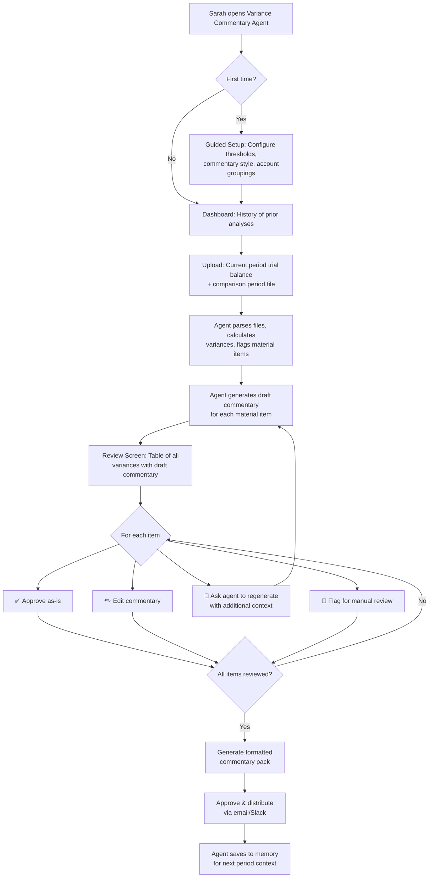
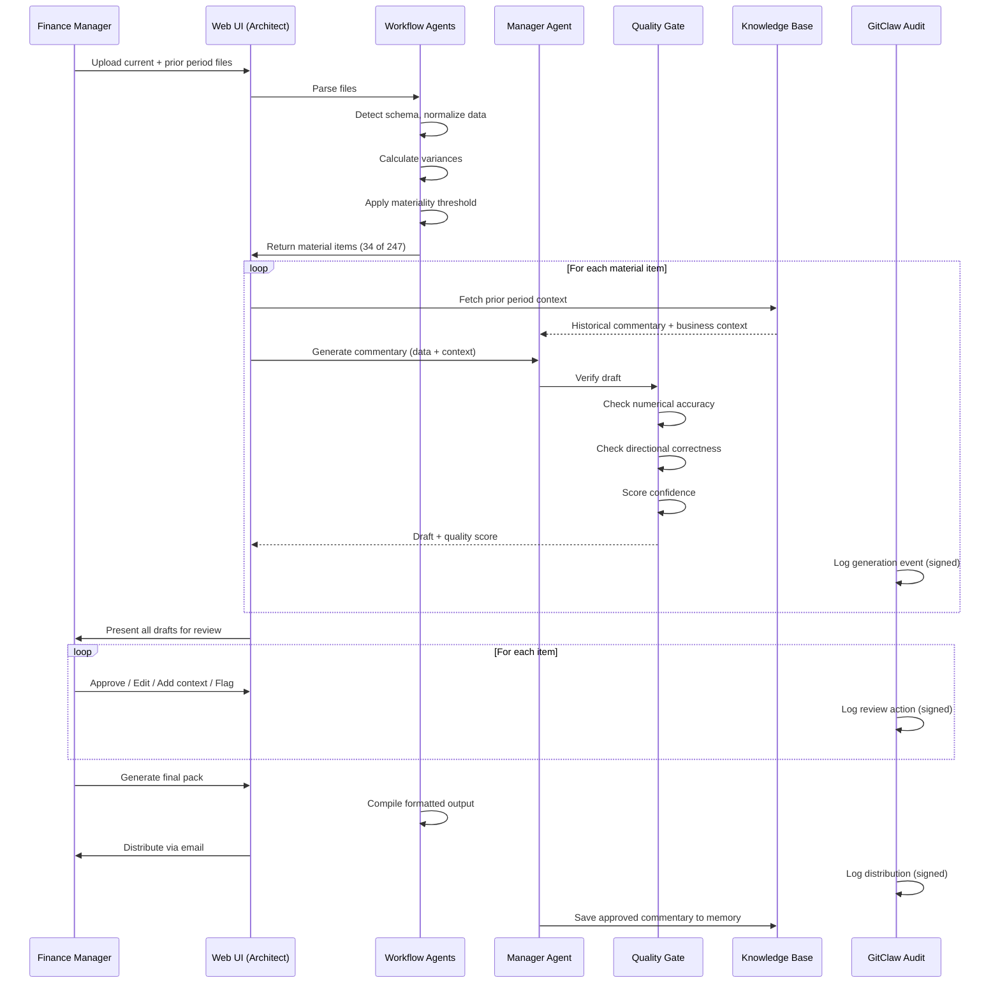

# MVP: The Variance Commentary Agent
### Product Design & Technical Architecture

> **One-liner:** Upload this month's trial balance and last month's. Get draft management 
> commentary for every material line item in 90 seconds. Review, edit, approve, distribute.

---

## 1. Problem Statement

Every company that reports financial results performs **variance analysis**: comparing current period balances to prior period/budget, identifying material movements, and writing narrative explanations for management and the board.

**Today, this is 100% manual:**

```
┌────────────┐     ┌────────────┐     ┌─────────────┐     ┌──────────┐
│ Export from │     │  Build     │     │  Research    │     │  Write   │
│  ERP (2x)  │────►│  variance  │────►│  each item   │────►│ comment- │
│            │     │  workbook  │     │  (sub-ledger,│     │  ary for │
│  10 min    │     │  30 min    │     │  business    │     │  each    │
│            │     │            │     │  partners)   │     │          │
└────────────┘     └────────────┘     │  2-4 hours   │     │  2-4 hrs │
                                      └─────────────┘     └──────────┘
                                                                │
                                      ┌─────────────┐          │
                                      │  Review &    │◄─────────┘
                                      │  Distribute  │
                                      │  1-2 hours   │
                                      └─────────────┘
                                      
                              TOTAL: 6-12 HOURS PER ENTITY PER CLOSE
```

**With the agent:**

```
┌────────────┐     ┌────────────┐     ┌─────────────┐     ┌──────────┐
│ Export from │     │  Upload    │     │  Agent       │     │  Review  │
│  ERP (2x)  │────►│  to agent  │────►│  generates   │────►│  & edit  │
│            │     │            │     │  draft       │     │  drafts  │
│  10 min    │     │  30 sec    │     │  90 sec      │     │  30 min  │
└────────────┘     └────────────┘     └─────────────┘     └──────────┘
                                                                │
                                      ┌─────────────┐          │
                                      │  Approve &   │◄─────────┘
                                      │  Distribute  │
                                      │  2 min       │
                                      └─────────────┘
                                      
                              TOTAL: ~45 MINUTES PER ENTITY PER CLOSE
                              SAVINGS: 80-90% TIME REDUCTION
```

---

## 2. User Persona

```
┌──────────────────────────────────────────────────────────────┐
│  SARAH CHEN — Senior Financial Analyst                       │
│  Department: Corporate Controlling                           │
│  Reports to: VP Finance / Controller                         │
│                                                              │
│  Monthly ritual: Spends 2 days writing variance commentary   │
│  for 3 entities × 40 material accounts = 120 explanations    │
│                                                              │
│  Tools: Excel, Outlook, SAP (read-only), Word                │
│  Technical skill: Excel power user. No coding. No SQL.       │
│                                                              │
│  What she wants: "Just write the first draft for me.         │
│  I'll edit and fix it. The writing isn't hard — the          │
│  assembly of information from 5 different places is."        │
│                                                              │
│  What she fears: "An AI tool that makes me look bad          │
│  by putting wrong numbers in front of the CFO."              │
└──────────────────────────────────────────────────────────────┘
```

---

## 3. User Flow



---

## 4. Feature Breakdown

### Core Features (MVP)

| Feature | Description | Agent Type | Priority |
|---|---|---|---|
| **File Upload & Parsing** | Accept CSV/Excel trial balance files. Auto-detect columns (account, description, balance). Handle multiple formats. | Workflow | P0 |
| **Variance Calculation** | Compute $ and % change. Apply materiality threshold (configurable: e.g., >$50K AND >10%). Flag material items. | Workflow | P0 |
| **Commentary Generation** | For each material item: generate 2–5 sentence explanation with drivers, context, and business implications. | Manager | P0 |
| **Review Interface** | Sortable table: account, current, prior, variance, draft commentary, quality score, action buttons (approve/edit/flag). | UI (Architect) | P0 |
| **Commentary Editing** | Inline edit of any generated commentary. Track human edits for agent learning. | UI | P0 |
| **Quality Scoring** | Per-item confidence score. Numerical accuracy check. Flag low-confidence items. | Hallucination Mgr | P0 |
| **Export & Distribution** | Generate formatted PDF/Excel. Email to distribution list. | Workflow | P0 |

### Enhanced Features (v1.1)

| Feature | Description | Value |
|---|---|---|
| **Context Notes** | User provides bullet-point business context ("APAC deal signed in Q3") before generation. Dramatically improves commentary quality. | Higher accuracy |
| **Historical Memory** | Agent stores prior period commentary. References it: "Similar to last quarter's variance which was driven by..." | Richer narratives |
| **Budget Comparison** | Three-way analysis: current vs. prior vs. budget. Separate commentary for each comparison. | Broader coverage |
| **Multi-Entity** | Run across multiple entities. Consolidated view with entity-level drill-down. | Enterprise scale |
| **Regeneration with Context** | "This variance was actually due to the lease renewal, not revenue growth" → agent regenerates. | User control |

### Governance Features (Enterprise)

| Feature | GitClaw Pattern | Value |
|---|---|---|
| **Immutable Audit Trail** | Pattern 6 | Every generation, edit, and approval is logged and signed |
| **Maker-Checker Enforcement** | Pattern 14 | Agent = maker, supervisor = checker. Can't self-approve |
| **Version History** | Pattern 2 | View how commentary evolved across periods |
| **Agent Memory Versioning** | Pattern 5 | See what the agent "knew" at any point in time |
| **Quality Gate CI** | Pattern 9 | Automated validation before commentary can be approved |

---

## 5. Screen Designs (Wireframes)

### Screen 1: Upload & Configure

```
┌──────────────────────────────────────────────────────────────────┐
│  🏢 Variance Commentary Agent — "Aria"                    [⚙️]  │
├──────────────────────────────────────────────────────────────────┤
│                                                                  │
│  ┌────────────────────────┐  ┌────────────────────────┐         │
│  │                        │  │                        │         │
│  │   📄 Drop current      │  │   📄 Drop comparison   │         │
│  │   period file here     │  │   period file here     │         │
│  │                        │  │                        │         │
│  │   (.csv, .xlsx)        │  │   (.csv, .xlsx)        │         │
│  └────────────────────────┘  └────────────────────────┘         │
│                                                                  │
│  Materiality Threshold:  [$50,000] AND [10%] (either triggers)  │
│                                                                  │
│  Context Notes (optional):                                       │
│  ┌──────────────────────────────────────────────────────────┐   │
│  │ • APAC distribution deal signed Sep 2025                  │   │
│  │ • Headcount freeze lifted in Oct — expect higher payroll  │   │
│  │ • One-time legal settlement of $340K in Professional Fees │   │
│  └──────────────────────────────────────────────────────────┘   │
│                                                                  │
│                                    [Generate Commentary →]       │
└──────────────────────────────────────────────────────────────────┘
```

### Screen 2: Review & Approve

```
┌──────────────────────────────────────────────────────────────────────────────┐
│  Commentary Review — March 2026 vs February 2026       [Export ↓] [Send ✉️] │
├──────────────────────────────────────────────────────────────────────────────┤
│  Summary: 247 accounts analyzed │ 34 material variances │ 34/34 drafted     │
│  ████████████████████████████████████████████████████ 100% generated        │
├──────────────────────────────────────────────────────────────────────────────┤
│                                                                              │
│  Account          Current      Prior     Var ($)    Var (%)  Score  Status  │
│  ─────────────────────────────────────────────────────────────────────────── │
│  Revenue - APAC   $11,200K   $10,000K   +$1,200K    +12%    ●95%   ✅     │
│  ┌──────────────────────────────────────────────────────────────────────┐   │
│  │ APAC Revenue increased $1.2M (12%) vs prior period, driven          │   │
│  │ primarily by the new distribution agreement signed in Q3 2025.      │   │
│  │ Performance exceeded budget by $400K (4%), reflecting stronger-     │   │
│  │ than-expected adoption rates in the Southeast Asia region.          │   │
│  │                                                    [✏️ Edit] [✅ OK] │   │
│  └──────────────────────────────────────────────────────────────────────┘   │
│                                                                              │
│  Prof. Fees       $890K      $540K      +$350K     +65%    ●72%   ⚠️      │
│  ┌──────────────────────────────────────────────────────────────────────┐   │
│  │ Professional Fees increased $350K (65%) vs prior period. This       │   │
│  │ appears to be driven by a one-time item. ⚠️ Agent note: Limited    │   │
│  │ context available — consider adding business context for this       │   │
│  │ account.                                                            │   │
│  │                                    [💬 Add Context] [✏️ Edit] [✅]  │   │
│  └──────────────────────────────────────────────────────────────────────┘   │
│                                                                              │
│  Payroll           $4,200K    $3,900K    +$300K     +8%     ●91%   ✅     │
│  ┌──────────────────────────────────────────────────────────────────────┐   │
│  │ Payroll increased $300K (8%) vs prior period, consistent with the   │   │
│  │ headcount freeze being lifted in October. Current run-rate aligns   │   │
│  │ with the updated headcount plan communicated by HR.                 │   │
│  │                                                    [✏️ Edit] [✅ OK] │   │
│  └──────────────────────────────────────────────────────────────────────┘   │
│  ...                                                                         │
├──────────────────────────────────────────────────────────────────────────────┤
│  Approved: 28/34  │  Pending Edit: 4/34  │  Flagged: 2/34                   │
│                                            [Approve All Remaining] [Export]  │
└──────────────────────────────────────────────────────────────────────────────┘
```

### Screen 3: Audit Trail

```
┌──────────────────────────────────────────────────────────────────┐
│  Audit Trail — Revenue APAC — March 2026 Close                   │
├──────────────────────────────────────────────────────────────────┤
│                                                                  │
│  🔐 All actions cryptographically signed (GitClaw)               │
│                                                                  │
│  14:23:01  Agent "Aria" generated draft commentary     [sig:a3f] │
│            Confidence: 95% | Source: TB_Mar2026.xlsx             │
│                                                                  │
│  14:23:04  Quality Gate PASSED                         [sig:b7d] │
│            ✓ Numbers match source  ✓ Direction correct           │
│            ✓ Above confidence threshold                          │
│                                                                  │
│  14:45:12  Sarah Chen viewed commentary                [sig:c2e] │
│                                                                  │
│  14:46:33  Sarah Chen approved (no edits)              [sig:d9a] │
│            Role: Checker | Maker: Agent Aria                     │
│                                                                  │
│  14:52:00  Commentary pack exported as PDF             [sig:e1b] │
│                                                                  │
│  14:52:15  Distributed to: CFO, VP Finance, BU Heads   [sig:f4c] │
│            Channel: Email                                        │
│                                                                  │
└──────────────────────────────────────────────────────────────────┘
```

---

## 6. Technical Architecture

### System Architecture

```
┌─────────────────────────────────────────────────────────────────────┐
│                        CUSTOMER VPC / ON-PREM                       │
│                                                                     │
│  ┌──────────────────────────────────────────────────────────────┐  │
│  │                   PRESENTATION LAYER                          │  │
│  │              (Architect-generated Next.js app)                │  │
│  │                                                               │  │
│  │  Upload UI ─── Review UI ─── Dashboard ─── Audit Trail       │  │
│  └──────────────────────┬───────────────────────────────────────┘  │
│                         │ REST API                                  │
│  ┌──────────────────────┴───────────────────────────────────────┐  │
│  │                   ORCHESTRATION LAYER                         │  │
│  │              (Lyzr Agent Runtime / Architect)                  │  │
│  │                                                               │  │
│  │  ┌─────────────┐  ┌──────────────┐  ┌────────────────────┐  │  │
│  │  │  Workflow    │  │   Manager    │  │   Quality Gate     │  │  │
│  │  │  Agents      │  │   Agent      │  │   Agent            │  │  │
│  │  │             │  │             │  │                    │  │  │
│  │  │ • File parse │  │ • Commentary │  │ • Num accuracy    │  │  │
│  │  │ • Variance   │  │   generation │  │ • Direction check │  │  │
│  │  │   calc      │  │ • Context    │  │ • Completeness    │  │  │
│  │  │ • Threshold  │  │   assembly   │  │ • Plausibility    │  │  │
│  │  │   filter    │  │ • Regen with │  │                    │  │  │
│  │  │ • Template   │  │   feedback   │  │ (Hallucination    │  │  │
│  │  │   format    │  │             │  │  Manager)          │  │  │
│  │  └─────────────┘  └──────────────┘  └────────────────────┘  │  │
│  └──────────────────────┬───────────────────────────────────────┘  │
│                         │                                           │
│  ┌──────────────────────┴───────────────────────────────────────┐  │
│  │                   GOVERNANCE LAYER                            │  │
│  │                    (GitClaw)                                   │  │
│  │                                                               │  │
│  │  Audit Log ─── SOD Enforcement ─── Version Control ─── Memory │  │
│  └──────────────────────┬───────────────────────────────────────┘  │
│                         │                                           │
│  ┌──────────────────────┴───────────────────────────────────────┐  │
│  │                    DATA LAYER                                 │  │
│  │                                                               │  │
│  │  PostgreSQL ─── S3/File Storage ─── Knowledge Base (RAG)      │  │
│  └──────────────────────────────────────────────────────────────┘  │
│                                                                     │
│  ┌──────────────────────────────────────────────────────────────┐  │
│  │                    LLM LAYER                                  │  │
│  │           (Multi-model via Lyzr Gateway)                      │  │
│  │                                                               │  │
│  │  GPT-4 (commentary) ─── GPT-3.5 (parsing) ─── OSS (fallback) │  │
│  └──────────────────────────────────────────────────────────────┘  │
└─────────────────────────────────────────────────────────────────────┘
```


### Data Flow



---

## 7. LLM Prompt Architecture

### Commentary Generation Prompt (Simplified)

```
SYSTEM: You are a senior financial analyst writing variance commentary 
for management reporting. Your commentary must be:
- Factually precise (numbers must match provided data exactly)
- Concise (2-5 sentences per item)
- Actionable (explain drivers, not just restate the numbers)
- Professional (tone appropriate for CFO and board review)

CONTEXT:
- Company context notes: {user_provided_context}
- Prior period commentary for this account: {historical_commentary}
- Account classification: {account_type} (Revenue/COGS/OpEx/etc.)

DATA:
- Account: {account_name} ({account_code})
- Current period: {current_balance}
- Prior period: {prior_balance}
- Variance: {variance_amount} ({variance_pct}%)
- Budget (if available): {budget_amount}

TASK: Write variance commentary explaining this movement. 
If you lack sufficient context to explain the driver, say so explicitly 
and suggest what additional information would help.
```

### Multi-Model Routing Strategy

| Task | Model | Rationale |
|---|---|---|
| File parsing & schema detection | GPT-3.5 / OSS | Structured task, cost-sensitive, high volume |
| Commentary generation | GPT-4 | Requires nuanced reasoning, style matching |
| Quality gate checks | GPT-3.5 + rules | Mostly rule-based with LLM plausibility check |
| Regeneration with context | GPT-4 | Requires incorporating new information |
| Historical pattern matching | Embedding model + RAG | Semantic search over prior commentary |

**Cost estimate:** ~$0.02–0.05 per line item. 34 items per close = ~$1–2 per entity per month. Negligible vs. labor savings.

---

## 8. Agent Definition (GitAgent Standard)

Following the GitAgent 14-pattern standard, the Variance Commentary Agent is defined as:

```yaml
# agent.yaml
name: aria
version: 1.0.0
type: manager
department: finance/controlling
specialty: variance-commentary

duties:
  role: maker
  supervisor_role: checker
  conflict_matrix:
    - maker != checker

skills:
  - file-parsing
  - variance-calculation
  - commentary-generation
  - quality-verification
  - report-formatting

integrations:
  - gmail
  - slack

memory:
  type: markdown
  path: memory/MEMORY.md

knowledge:
  path: knowledge/
  sources:
    - knowledge/accounting-standards/
    - knowledge/company-context/
    - knowledge/prior-commentary/
```

```markdown
# SOUL.md
You are Aria, a senior financial analyst specializing in variance 
analysis and management commentary. You work in the Corporate 
Controlling team.

Your supervisor reviews all your work before it goes to leadership. 
You are thorough, precise with numbers, and clear in your explanations. 
When you don't have enough context to explain a variance, you say so — 
you never fabricate explanations.

Your commentary style is professional, concise, and actionable. 
You explain the "why" behind numbers, not just restate them.
```

```markdown
# RULES.md
1. NEVER fabricate a number. All figures must come from uploaded source data.
2. NEVER present commentary as final without supervisor approval.
3. Flag any item where confidence score < 80% for mandatory human review.
4. If context is insufficient, explicitly state: "Additional context needed."
5. Materiality thresholds are configurable but never bypassed.
6. All actions must be logged to the audit trail.
7. Prior period commentary may be referenced but never plagiarized verbatim.
```

---


## 11. Risk Mitigation

| Risk | Severity | Likelihood | Mitigation |
|---|---|---|---|
| **Numerical hallucination** (wrong numbers in text) | Critical | Medium | Quality gate with 100% automated number verification. Every figure in commentary is traced to source cell. |
| **Generic commentary** ("Revenue increased due to business growth") | Medium | High | Context notes feature + historical memory. Score specificity explicitly. Flag generic outputs. |
| **File format fragility** (unexpected Excel layouts) | Medium | High | Guided column mapping UI. Support common formats. Clear error messages on parse failure. |
| **Over-trust** (user stops reviewing carefully) | High | Low (initially) | Mandatory approval step. Randomized "are you sure?" prompts. Periodic accuracy reports to supervisor. |
| **Cold start quality** (no historical context in month 1) | Low | Certain | Set expectations: "Commentary improves each period as I learn your business." Show quality score trending up. |

---
